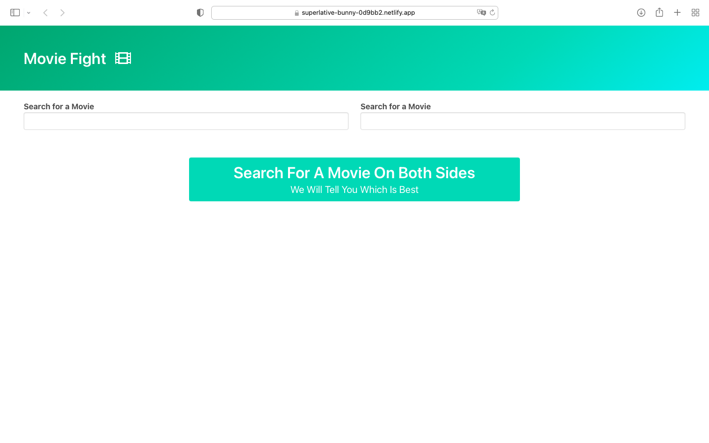
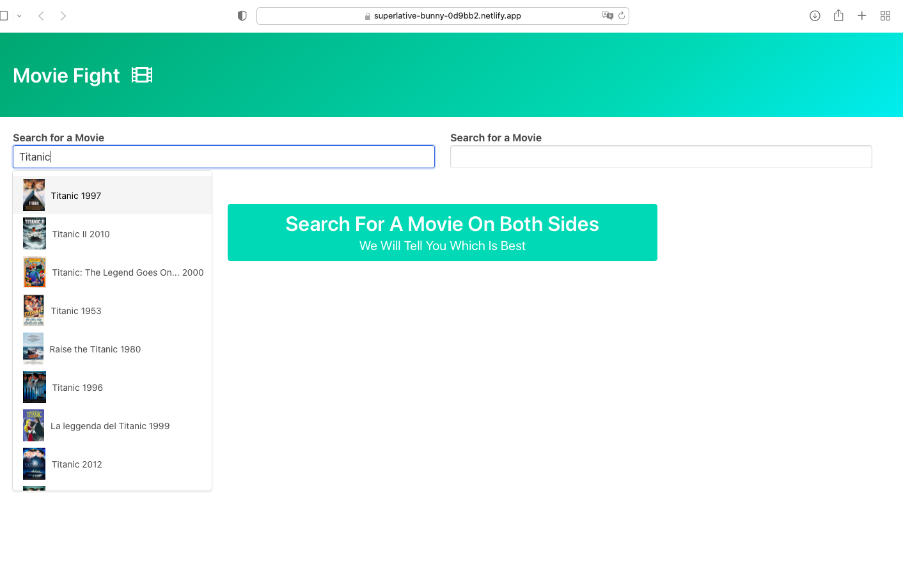
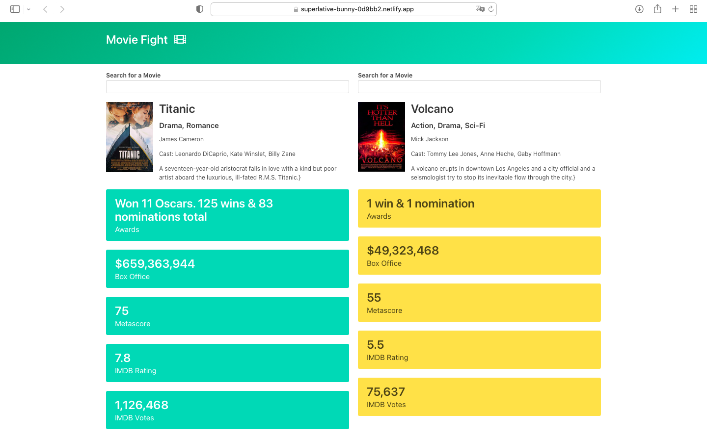

## Content ;

1. Title Of app & Quick Intro.
2. app Screenshots.
3. Technologies Used.
4. Getting Started.

---

---

### 1. Title Of The App :

Movie fight

---

### 1. Quik Intro :

Movie fight allows you to compare two different movies and outstands
the one with better results.

---

### 2. Game Screenshots :

1. Main page.

2. After searching

3. After selecting the two movies that are being compared

---

### 3. Technologies Used :

1. HTML
2. CSS
3. JavaScript
4. git
5. gitHub
6. Netlify
7. Axios
8. DOM manipulation

---

### 4. Getting Started :

Click [here](https://superlative-bunny-0d9bb2.netlify.app) to view the app

---
